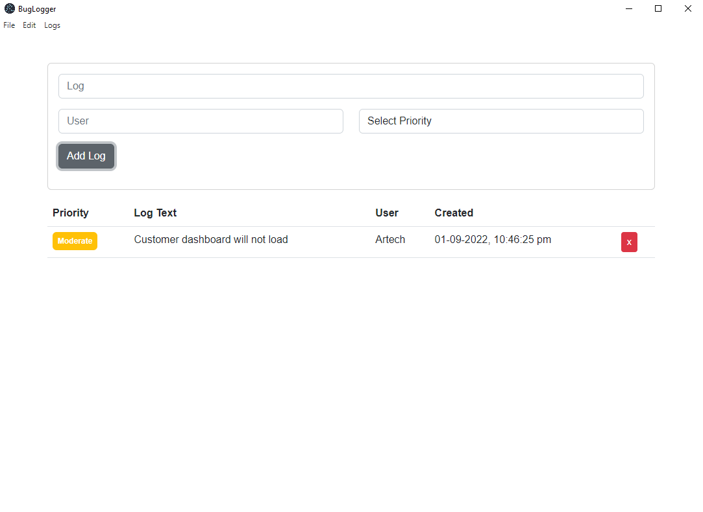

# BugLogger Electron 20 - React 18 frontend

A simple bug logger desktop application built with Electron 20 and React 18. The application is a simple bug logger that allows users to create, edit, and delete bugs. The data is stored on MongoDB Atlas. The application is designed to be shared across multiple users.

- Babel used to transpile modern JavaScript syntax - development
- Webpack used to bundle the app - development
- css-loader : import css files
- style-loader : import styles
- file-loader : import files
- electron-devtools-installer
- Mongoose used to connect to MongoDB - for object modeling schema

<p align="center"></p>

# React

- Functional components used with hooks as opposed to using classes

# Scripts

- `npm run start` : 1. Sets the node environment to development, 2. Starts the webpack dev server, 3. Starts the electron app
- `npm run prod` : 1. Sets the node environment to production, 2. Builds the app, 3. Use the index.html from the `dist` folder from the compiled react app
- `npm run package` : 1. Build the react application out into the `released-builds-folder`

# Dependencies

```json
    "dependencies": {
        "bootstrap": "^5.2.0",
        "react": "^18.2.0",
        "react-bootstrap": "^2.5.0",
        "react-dom": "^18.2.0"
    }
```

# Dev Dependencies

```json
    "devDependencies": {
        "@babel/core": "^7.9.6",
        "@babel/preset-env": "^7.9.6",
        "@babel/preset-react": "^7.9.4",
        "babel-loader": "^8.1.0",
        "babili-webpack-plugin": "^0.1.2",
        "cross-env": "^7.0.2",
        "css-loader": "^3.5.3",
        "electron": "^20.1.0",
        "electron-devtools-installer": "^3.0.0",
        "electron-packager": "^14.2.1",
        "file-loader": "^6.0.0",
        "html-webpack-plugin": "^4.3.0",
        "mini-css-extract-plugin": "^0.9.0",
        "style-loader": "^1.2.0",
        "webpack": "^4.43.0",
        "webpack-cli": "^3.3.11",
        "webpack-dev-server": "^3.10.3"
    },
```

# Webpack Config

- `webpack.build.config.js`
  - style-loader
  - babel-loader
  - import images
  - use the html webpack plugin to use the index.html file from the `src` folder
- `webpack.dev.config.js`
  - css minify
  -

# Packages - full list

```
├── @babel/core@7.9.6
├── @babel/preset-env@7.9.6
├── @babel/preset-react@7.9.4
├── babel-loader@8.1.0
├── babili-webpack-plugin@0.1.2
├── bootstrap@5.2.0
├── cross-env@7.0.2
├── css-loader@3.5.3
├── electron-devtools-installer@3.0.0
├── electron-packager@14.2.1
├── electron@20.1.1
├── file-loader@6.0.0
├── html-webpack-plugin@4.3.0
├── mini-css-extract-plugin@0.9.0
├── moment@2.29.4
├── mongoose@6.5.4
├── react-bootstrap@2.5.0
├── react-dom@18.2.0
├── react-moment@1.1.2
├── react@18.2.0
├── style-loader@1.2.1
├── webpack-cli@3.3.11
├── webpack-dev-server@3.10.3
└── webpack@4.43.0
```

# Instructions

- Clone repo and run `npm install`
- Set up database on mongoDB Atlas and add the connection string to the `config/db.js` file
- Run `npm run prod` to compile and start the app

# Build

- Run `npm run postpackage-win32` to build the app for windows
- Run `npm run postpackage-linux` to build the app for linux
- Run `npm run postpackage-darwin` to build the app for mac
